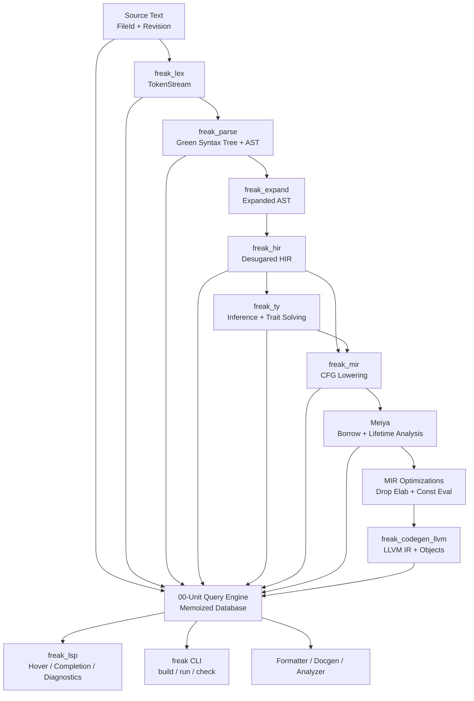
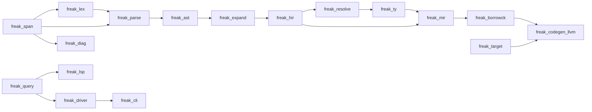
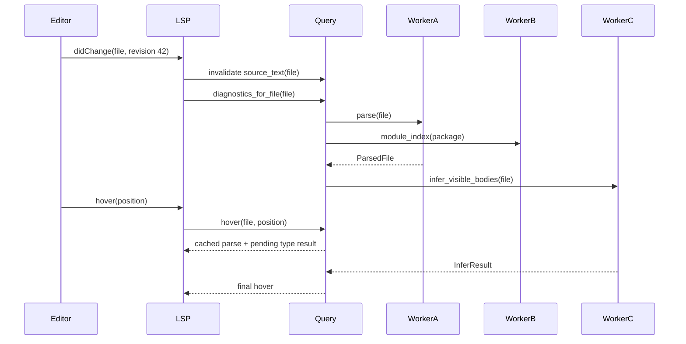
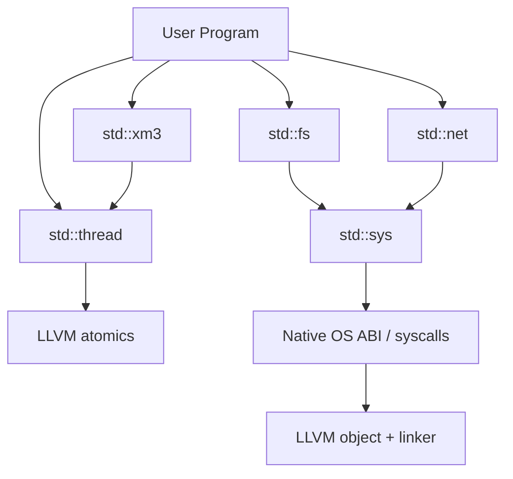
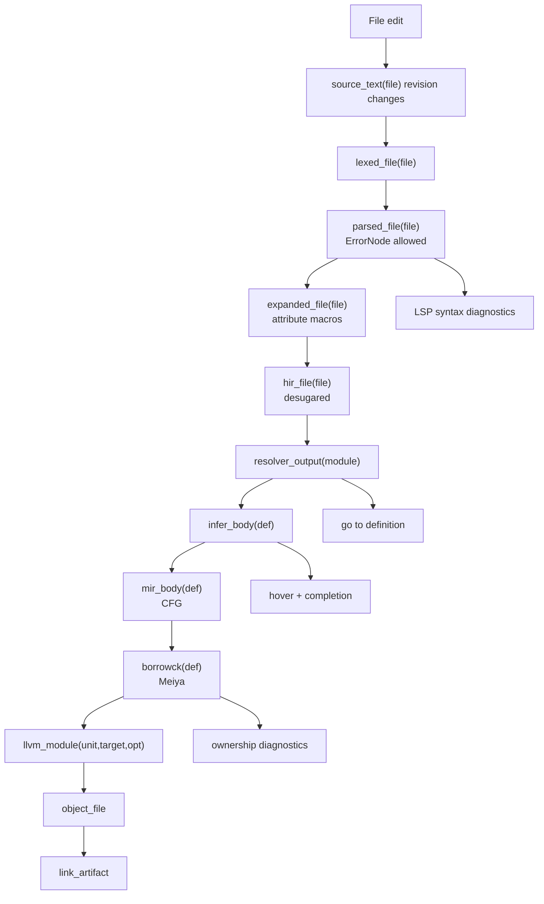

# freakc_v4 Project 00-Unit Architecture Manifesto

## Alternative IV Compiler Blueprint

FREAK v3 proved the impossible part: the language can bootstrap itself, emit LLVM/C, and stand on its own feet. That victory also exposed the next wall. A self-hosted compiler that remains monolithic, single-pass, and syntax-coupled will eventually become a maze where every feature asks for a rewrite, every diagnostic needs a new side channel, and every tool has to fake the compiler's understanding from the outside.

Project 00-Unit is the answer.

freakc_v4 is not "the next compiler rewrite." It is the last compiler architecture FREAK should need for a very long time. V4 is a compiler platform: modular, query-based, persistent, embeddable, fault-tolerant, and designed for real-time tooling from day one.

Yuuko's theory is simple: if every layer can be asked a precise question and every answer can be cached, invalidated, inspected, and reused, the compiler stops being a pipeline and becomes an intelligence network. Meiya's borrow checker gets a stable battlefield. The XM3 processing model gets parallel speculative work instead of a single exhausted pilot. The anime layer gets infinite room to grow without turning the parser into a shrine of special cases.

This document is the engineering blueprint for freakc_v4.

---

## Core Mandate

freakc_v4 must satisfy six non-negotiable properties:

1. **Resilient syntax** - parsing never halts the compiler. Syntax errors become syntax nodes with spans, diagnostics, and recovery boundaries.
2. **Strict IR layering** - AST, HIR, MIR, type information, borrow information, and codegen information are separate products with separate owners.
3. **Query-based execution** - every compiler stage is exposed as a memoized query with precise dependencies.
4. **Compiler as a library** - the CLI, LSP, package manager, test runner, formatter, and IDEs all call the same compiler crates.
5. **Native systems ABI** - FREAK talks directly to operating systems, C ABIs, LLVM intrinsics, and platform linkers without depending on emitted C wrappers.
6. **Plugin-driven identity** - narrative and anime-facing language affordances are extensible compiler plugins, not permanent parser bloat.

The public promise is:

```text
Edit one line.
Invalidate only the facts that line could have changed.
Re-answer every tool query from the same compiler brain.
Emit native code without rewalking the world.
```

---

## Top-Level Architecture



The critical design choice is that the arrows are not hardcoded function calls in one long procedure. Each box is a query provider. The CLI may ask for `link_artifact(package)`. The LSP may ask for `hover(file, position)`. The test runner may ask for `test_inventory(package)`. The formatter may ask only for `parse(file)`. The same database answers all of them.

---

# 1. The Modular Pipeline

## Escaping the Rewrite Loop

The v3 compiler's architectural risk is that parser, checker, emitter, diagnostics, and feature logic can become entangled. A new syntax feature then requires edits across the parser, checker, emitter, CLI, LSP, tests, and docs in one painful chain.

V4 breaks this by making every layer consume a smaller and more stable language than the layer before it.

```text
User-facing FREAK syntax
    -> AST: exact syntax, recoverable, source-faithful
    -> Expanded AST: plugin output, still syntax-shaped
    -> HIR: name-aware, desugared, syntax-independent
    -> Typed HIR facts: expression, pattern, and signature types
    -> MIR: CFG, places, moves, drops, borrows, terminators
    -> LLVM IR: target-aware low-level operations
```

New syntax should usually stop at HIR lowering. New type behavior should usually stop at `freak_ty`. New ownership rules should usually stop at MIR and Meiya. New backend behavior should usually stop at codegen.

## Stage 0: Source Database

All compiler input starts as stable source facts.

```fk
shape FileId {
    package: PackageId
    path_hash: uint
}

shape SourceFile {
    id: FileId
    text: word
    revision: uint
    line_index: LineIndex
    content_hash: Hash128
}

shape Span {
    file: FileId
    start_byte: uint
    end_byte: uint
}
```

Rules:

- `Span` is used by every layer, including generated macro nodes.
- `FileId` is stable across edits as long as the path remains stable.
- Revisions are cheap invalidation keys.
- Line maps are cached so diagnostics and LSP positions do not rescan source text.
- Source text is immutable inside one query revision.

## Stage 1: Lexing

`freak_lex` is deliberately boring. It does not know grammar, imports, types, macros, or modules. It produces tokens and lexical diagnostics.

```fk
route TokenKind {
    Ident(word)
    Keyword(KeywordKind)
    Literal(LiteralKind)
    Symbol(SymbolKind)
    Trivia(TriviaKind)
    Unknown(tiny)
}

shape Token {
    kind: TokenKind
    span: Span
}

shape LexedFile {
    file: FileId
    tokens: TokenStream
    diagnostics: List<Diagnostic>
}
```

Lexing is incremental-friendly:

- Trivia is preserved for formatting.
- Unknown bytes become `Unknown` tokens instead of fatal errors.
- String interpolation is tokenized structurally, not pre-lowered.
- Comments may carry doc attributes, but are not interpreted by the lexer.

The lexer does not decide whether `training arc` is legal. It only reports that the source contains the keywords `training` and `arc`.

## Stage 2: Resilient AST

`freak_parse` produces a source-faithful syntax tree. The AST represents what the user typed, not what the compiler wishes they had typed.

V4 uses two related structures:

- **Green tree** - immutable, lossless, parentless syntax tree for incremental reparsing.
- **AST facade** - typed node wrappers over the green tree for ergonomic compiler code.

```fk
route SyntaxKind {
    SourceFile
    TaskDecl
    ShapeDecl
    ImplDecl
    Attribute
    BlockExpr
    IfExpr
    WhenExpr
    ForEachExpr
    TrainingArcExpr
    IsekaiExpr
    EventuallyExpr
    BinaryExpr
    CallExpr
    ErrorNode
    IncompleteNode
}

shape SyntaxNode {
    kind: SyntaxKind
    span: Span
    children: List<SyntaxElement>
}

shape ErrorNode {
    span: Span
    expected: List<SyntaxExpectation>
    found: maybe<TokenKind>
    recovery: RecoveryKind
}

shape IncompleteNode {
    span: Span
    intended: SyntaxKind
    missing: List<SyntaxExpectation>
    usable_children: List<SyntaxNode>
}

shape ParsedFile {
    file: FileId
    green: GreenNode
    ast: SourceAst
    diagnostics: List<Diagnostic>
}
```

### ErrorNode

`ErrorNode` represents text that could not be attached to a valid grammar production. It is not thrown away.

Example:

```fk
task main( {
    say "missing parameter close"
}
```

The parser should still produce:

```text
TaskDecl
  name: main
  params: IncompleteNode(ParameterList, missing: ")")
  body: BlockExpr
```

The LSP can still show symbols, fold the block, provide completions inside the body, and report the exact missing delimiter.

### IncompleteNode

`IncompleteNode` means the parser recognized the user's intent but required a placeholder to keep the tree shaped.

Examples:

- `pilot x =` becomes a `LetStmt` with an incomplete initializer.
- `when mood { .hype => }` becomes a match arm with an incomplete body.
- `shape Vec2 { x: num, }` remains a valid `ShapeDecl`.

The parser's oath:

```text
No syntax error may prevent:
- module discovery
- top-level item indexing
- symbol search
- best-effort type checking of unaffected items
- diagnostics from later compiler stages
```

## Stage 3: Attribute Macro Expansion

Before HIR, the AST passes through the macro expansion layer. Built-in and third-party attribute macros transform AST into AST. They may attach metadata, generate declarations, rewrite attributes, or emit diagnostics, but they may not reach into MIR or codegen.

Macro expansion output is still source-shaped:

```fk
shape ExpandedFile {
    file: FileId
    ast: SourceAst
    generated_nodes: List<GeneratedNode>
    diagnostics: List<Diagnostic>
    expansion_graph: ExpansionGraph
}
```

Every generated node carries:

- call-site span
- definition-site span
- macro package id
- hygiene context
- stable expansion id

This is how `@protagonist`, `@nakige`, `@season_finale`, and future narrative attributes can remain powerful without becoming parser law.

## Stage 4: HIR - High-Level IR

HIR is the first compiler-owned language. It is not required to preserve surface syntax. It exists to give name resolution, type inference, docs, and later lowerings a stable representation.

The rule is:

```text
The type checker must never learn a user-facing syntax feature if that feature can be desugared into existing HIR.
```

HIR has stable ids:

```fk
shape DefId {
    package: PackageId
    path_hash: Hash128
}

shape HirId {
    owner: DefId
    local: uint
}

shape HirFile {
    file: FileId
    items: List<HirItemId>
    diagnostics: List<Diagnostic>
}

route HirItem {
    Module(HirModule)
    Import(HirImport)
    Task(HirTask)
    Shape(HirShape)
    Doctrine(HirDoctrine)
    Impl(HirImpl)
    Const(HirConst)
    ExternBlock(HirExternBlock)
}
```

HIR expressions are intentionally universal:

```fk
route HirExpr {
    Missing
    Literal(HirLiteral)
    Path(HirPath)
    Local(HirLocalId)
    Block(HirBlock)
    If(HirIf)
    Match(HirMatch)
    Loop(HirLoop)
    Break(maybe<HirExprId>)
    Continue
    Return(maybe<HirExprId>)
    Call(HirCall)
    MethodCall(HirMethodCall)
    Unary(HirUnary)
    Binary(HirBinary)
    Assign(HirPlaceExpr, HirExprId)
    Field(HirExprId, Name)
    Index(HirExprId, HirExprId)
    Closure(HirClosure)
    Defer(HirExprId)
}
```

### Desugaring Examples

#### `for each`

Surface syntax:

```fk
for each pilot item in inventory {
    say item.name
}
```

HIR:

```text
Block
  let __iter = IntoIterator::into_iter(inventory)
  Loop
    Match Iterator::next(__iter)
      some(item) -> Block(...)
      nobody -> Break
```

The type checker only sees a call to `IntoIterator::into_iter`, a `Loop`, a `Match`, and ordinary bindings. Adding a new collection type requires doctrine implementations, not checker surgery.

#### `training arc`

Surface syntax:

```fk
training arc attempt from 0 to max_attempts {
    if ready() {
        break
    }
}
```

HIR:

```text
Block
  let __limit = max_attempts
  let attempt = 0
  Loop(kind: Bounded)
    If attempt >= __limit -> Break
    Block(...)
    attempt = attempt + 1
```

The bounded-loop guarantee is represented as HIR metadata:

```fk
shape LoopFacts {
    kind: LoopKind
    max_iterations: maybe<HirExprId>
    termination_proof: maybe<TerminationProofId>
}
```

Meiya and MIR do not care that the loop was called `training arc`. They care that it is a loop with explicit control edges and optional termination facts.

#### String interpolation

Surface syntax:

```fk
say "Pilot {name} has {power} power."
```

HIR:

```text
Call(std::io::say,
  [Call(std::string::concat_many,
    ["Pilot ", Display::to_word(name), " has ", Display::to_word(power), " power."])])
```

The type checker sees calls and doctrine obligations. The emitter sees regular calls.

#### Pipe operator

Surface syntax:

```fk
input |> trim |> parse_int |> clamp(0, 100)
```

HIR:

```text
Call(clamp, [Call(parse_int, [Call(trim, [input])]), 0, 100])
```

No backend ever learns about pipes.

#### `eventually`

Surface syntax:

```fk
eventually {
    file.close()
}
```

HIR:

```text
Defer(Block(...))
```

MIR lowering expands `Defer` into cleanup blocks and drop ordering.

#### `isekai`

Surface syntax:

```fk
pilot result = isekai {
    pilot secret = compute()
    bringing back { secret }
}
```

HIR:

```text
Block(scope: Fresh)
  let secret = compute()
  BreakValue Tuple(secret)
```

The scope isolation is not syntax magic after HIR. It is a scoped ownership and visibility boundary.

## Stage 5: Name Resolution

Name resolution is a query layer over HIR, not a parser side effect.

```fk
shape ResolverOutput {
    module: DefId
    imports: ImportMap
    values: ScopeMap<ValueNs>
    types: ScopeMap<TypeNs>
    doctrines: ScopeMap<DoctrineNs>
    macros: ScopeMap<MacroNs>
    diagnostics: List<Diagnostic>
}
```

Resolution produces stable `DefId` references. It does not infer types. It answers:

- Which item does this path name?
- Which local does this identifier bind to?
- Which imports are unused, ambiguous, or missing?
- Which macro namespace owns this attribute?

The LSP uses this directly for "go to definition" and symbol rename.

## Stage 6: Type Inference and Trait Solving

`freak_ty` consumes HIR plus resolution facts and produces typed facts.

```fk
shape TyId {
    interned: uint
}

shape InferResult {
    owner: DefId
    expr_types: Map<HirExprId, TyId>
    pattern_types: Map<HirPatId, TyId>
    obligations: List<TraitObligation>
    adjustments: List<TypeAdjustment>
    diagnostics: List<Diagnostic>
}
```

Type inference does not perform codegen. It creates obligations:

```fk
shape TraitObligation {
    source: ObligationSource
    self_ty: TyId
    doctrine: DoctrineId
    params: List<TyId>
}
```

Examples:

- `a + b` creates `a: Add<rhs=b, output=?>`.
- `for each` lowering creates `inventory: IntoIterator`.
- interpolation creates `value: Display`.
- `?` creates result-carrier obligations.

The type checker's boundary is sacred. It may request HIR, resolution, signatures, and impl maps. It may not request LLVM state.

## Stage 7: MIR - Mid-Level IR

MIR is FREAK's battlefield representation. It lowers typed HIR into a Control Flow Graph where every move, borrow, branch, drop, and panic edge is explicit.

```fk
shape MirBody {
    owner: DefId
    locals: List<MirLocal>
    args: List<LocalId>
    return_local: LocalId
    basic_blocks: List<BasicBlock>
    var_debug_info: List<VarDebugInfo>
    source_scopes: List<SourceScope>
}

shape BasicBlock {
    id: BasicBlockId
    statements: List<MirStatement>
    terminator: MirTerminator
}

route MirStatement {
    Assign(Place, Rvalue)
    StorageLive(LocalId)
    StorageDead(LocalId)
    Retag(Place, BorrowKind)
    SetDiscriminant(Place, VariantId)
    DropFlagSet(DropFlagId, bool)
    Nop
}

route MirTerminator {
    Goto(BasicBlockId)
    SwitchInt(Operand, List<SwitchTarget>)
    Call(CallTarget, List<Operand>, Place, BasicBlockId, BasicBlockId)
    Return
    Resume
    Abort
    Drop(Place, BasicBlockId, maybe<BasicBlockId>)
    Assert(Operand, AssertKind, BasicBlockId, BasicBlockId)
    Unreachable
}

shape Place {
    local: LocalId
    projection: List<PlaceElem>
}

route PlaceElem {
    Field(FieldId)
    Index(LocalId)
    Deref
    Downcast(VariantId)
}
```

MIR has no `for each`, no `training arc`, no `when`, no interpolation, no pipe operator, and no anime sugar. It has control flow.

## Meiya: Borrow Checking on MIR

Meiya is the V4 borrow checker. It operates on MIR because ownership is a control-flow property, not a syntax property.

At full V4 completion, Meiya computes:

- move paths
- loan regions
- mutable and shared borrow conflicts
- drop liveness
- storage liveness
- partial moves
- escape analysis
- async/thread boundary ownership
- destructor ordering
- lifetime outlives constraints

Core structures:

```fk
shape MovePath {
    id: MovePathId
    place: Place
    parent: maybe<MovePathId>
}

shape Loan {
    id: LoanId
    borrowed_place: Place
    kind: BorrowKind
    issued_at: Location
    live_region: RegionId
}

shape Region {
    id: RegionId
    points: BitSet<Location>
}

shape BorrowckResult {
    owner: DefId
    loans: List<Loan>
    move_paths: List<MovePath>
    drop_flags: List<DropFlag>
    region_values: Map<RegionId, BitSet<Location>>
    diagnostics: List<Diagnostic>
}
```

### Implemented Contract-Region Checkpoint (V4 Partial)

The current Meiya landing is a signature-contract source-set slice for ordinary
static tasks. It is deliberately narrower than the location-based general
region solver described below and does not establish production backend support.

| Layer | Owned fact | Implemented guarantee |
|---|---|---|
| `freak_ty` | Declared lifetime graph, eligible parameter ids, and fixed-storage classification | An explicit bound such as `'long: 'short` is a directed edge. Declared binders are reflexive, direct edges close transitively, and cycles make their members mutually reachable. An iterative, cycle-safe worklist handles converging graphs and long chains without recursive stack growth. Named returns select every mode-compatible parameter whose lifetime reaches the return lifetime; elided returns select every mode-compatible borrowed parameter. Shared returns admit `lend` and `lend mut`; mutable returns admit only `lend mut`. TY classifies tuples, fixed arrays, shapes, and route payloads as the task-local fixed-layout vocabulary. Generic-call, owner-generic, and `Shared<T>::new` substitutions recursively expand nominal shapes/routes such as `Direct<'a>` before rejecting hidden lends. Classification exhaustion is a distinct fail-closed state with a targeted depth-budget diagnostic; conservative ownership queries treat it as possibly lend-bearing. Ordinary-task aggregate parameters and returns, aliases, doctrines, and callbacks remain closed to lend-bearing storage. |
| `freak_mir` | Candidate call mappings and declaration-keyed aggregate children | MIR erases callee binder spelling from the caller-local result but maps every eligible signature parameter to its reordered call argument. `-1` means opaque/unproven, `0` is a proven-empty set, and a positive count is a fully mapped candidate set. This is candidate metadata, not caller ownership. Tuple slots and fixed-array indices are stable structural keys. Shape and route children are normalized into declaration order and recover their declared field projection independent of constructor source order. That representation requires `freak-mir-snapshot-v5`; v4 is rejected rather than reinterpreted. Direct nominal impl calls and overloaded operator dispatch on lend-bearing aggregate owners are rejected at the call boundary. Dynamic/container constructors still reject lend children while child type and span identity exist. |
| `freak_borrowck` / Meiya | Concrete owner-path and projected-child provenance | Meiya resolves MIR candidates through projections, scalar and fixed-layout aggregate holders, projected reborrows, nested statically resolved ordinary calls, acyclic CFG joins, and loop headers/backedges. Aggregate provenance memos include the requested projection: field or slot uses resolve only that declaration-keyed child, while whole-value or dynamic-index uses conservatively union possible children. A dynamic-index assignment overlaps every fixed slot and therefore cannot retire or launder one child loan. Projection assignment is a holder definition: rebinding retires only the selected child's old loan, protects its new owner, and preserves siblings; aggregate moves into projected destinations retain relative child paths. This supplies field-sensitive final-use liveness and preserves `LoanMut` exclusivity for the relevant child. Restore starts a fresh provenance scratch generation. It discovers memo dependencies iteratively, records reverse edges, and schedules only dependants of changed memos in deterministic waves to reach a monotonic least fixed point. Known sets deduplicate and union every concrete caller owner; unresolved empty memos and path-growing projections become opaque. Only Meiya emits queryable `ReturnLoan` / `ReturnLoanMut` paths. Bounded integer/canonical-path cache rings and explicit memo/dependency/work/source/path budgets rebuild or fail closed without changing provenance semantics. |
| `freak_editor` plus query/snapshot crates | Lifetime semantic, hover, definition, restore, and invalidation facts | Outlives-bound references resolve to the declared binder even when that declaration appears later or the bound is repeated. Distinct definitions and spans survive snapshot restore after the live editor arenas have been poisoned. Fixed-layout local type and provenance facts use the existing MIR, borrowck, editor, and query sections; no aggregate-only snapshot or LSP method exists. Stale or fingerprint-mismatched restored entries are not promoted. Source changes update all 17 invalidation report fields: 14 concrete query families plus three aggregate totals (`all`/`query`, `core`, and `editor`); explicit requests prove every concrete family recomputes and the totals refresh. The fixed-aggregate query smoke proves `A -> B -> restore A` and re-resolves MIR, borrowck, and editor IDs from the restored arenas. |

TY's iterative lifetime closure uses queue/visited arrays as high-water scratch:
each traversal resets the active prefix, later queries reuse capacity, and
repeated converging or long-chain checks do not accumulate active historical
rows. Eligible returned-loan formal parameter ids are materialized lazily in a
bounded flat cache keyed by immutable `(ty_id, sig_id)`. Ordered ids are encoded
in the row payload, avoiding a child array per signature; an empty payload is a
known-empty result because row presence distinguishes it from a miss. Count and
indexed lookup share that row, so MIR does not retraverse the lifetime graph for
every candidate. Ring eviction rebuilds deterministically, and restoring a TY
file or signature invalidates its matching rows before reuse.

Provenance expansion is memoized per `(MIR, body, use location, rvalue,
projection)` within
one borrowck generation. A new generation resets active state/source/memo
cursors. Dependency discovery walks the dynamically growing memo prefix as an
iterative worklist; nested holder/call lookups only intern another memo and
return its partial fact, so neither a cycle nor a long acyclic chain consumes
the native call stack. Every lookup records a reverse dependency edge in a
per-memo adjacency list. Meiya then performs two deterministic monotonic phases
whose worklists schedule only dependants of a memo whose revision changed. The
solver retains a solved-memo frontier between top-level provenance queries, so
later independent roots seed discovery, queued-state cleanup, finalization, and
both propagation phases only from newly added memos rather than replaying the
entire generation. Generation-stamped per-body memo chains keep root lookup
proportional to the memo count in that MIR body instead of every prior body in
the file. The source phase unions concrete
owners until the revision counter stabilizes; every still-empty memo is
conservatively made opaque; the opacity phase propagates that state through the
same graph. Each phase may execute at most `new_memo_count + 1` deterministic waves.
Identity self-edges are no-ops, while projected self-edges that would grow a
path become opaque. Hitting the round bound marks the whole generation opaque.

The same fail-closed rule applies at explicit generation budgets: 4,096 memo
entries, 16,384 reverse dependency edges, 65,536 processed work items, 1,024
concrete source facts, and 1,024 bytes per canonical owner path.
Active rows are therefore bounded by both the visited provenance graph and hard
resource ceilings; backing arrays reuse high-water capacity and do not retain
historical active rows. Integer-word interning backs those rows, and the
canonical-path cache reuses both exact-input mappings and existing
whitespace-free canonical values across repeated generations. Each cache is a
bounded ring: churn evicts old rows, an evicted value rebuilds to the same
result, and repeated hot values do not allocate another row. The bootstrap
runtime's array-handle table grows dynamically rather than imposing a hidden
256-handle ceiling. Cache eviction does not yet reclaim displaced word
allocations from append-only compiler arenas. Round/limit/solve/convergence,
resource-exhaustion, and work-item telemetry is keyed by borrowck result and
persists through borrowck snapshot v2, making restore and resource behavior
queryable and executable. Legacy v1 snapshots remain importable with default
telemetry; a v2 record missing any telemetry field fails validation. CFG block
reachability, holder liveness, and holder-alias expansion use explicit
cycle-safe worklists. A
64-diamond fixture proves forward and reverse reachability without recursive
stack growth.

The runtime-value storage boundary is split by representation stability.
Task-local tuples, fixed arrays, shapes, and route payloads may contain shared
or mutable lends. This is a frontend ownership fact, not an aggregate task ABI
or a backend/runtime layout guarantee.

MIR gives every supported child a stable projection key. Tuple slots use `.N`
and fixed arrays use `[N]`; repeat-filled arrays use the conservative `[*]`
identity. Shape and route constructor children are normalized into declaration
order, then recovered by declared field name. Constructor source order cannot
silently move Yuuko's field label onto a different Meiya loan.

Meiya keys aggregate provenance by the rvalue and requested projection. Local
aggregate holder aliases preserve that projection path. A later `.0`, `.field`, or
constant `[index]` use therefore extends only the selected child's loan and
does not keep unrelated siblings live. Whole-value uses and non-constant array
indices conservatively union every possible child. Dynamic-index assignment
targets overlap every fixed slot, so rebinding cannot selectively erase one
child loan. `LoanMut` remains exclusive against overlapping owner observations,
writes, moves, and loans while that projected holder is live. Repeat-filling multiple slots from one `lend mut` is
diagnosed because one exclusive loan cannot be cloned into a formation.

A projection assignment is a new holder definition, not a write into an opaque
aggregate bunker. Rebinding `.left` releases only `.left`'s previous loan,
installs protection for the newly stored owner, and leaves `.right` intact.
When an aggregate moves into another projected destination, Meiya rebases the
aggregate root while retaining every relative child projection, so Yuuko's map
and Meiya's patrol describe the same owner paths.

These facts use the existing tooling protocols. Declaration-order aggregate
children require `freak-mir-snapshot-v5`; v4 is rejected rather than silently
reinterpreted. Component restore, 00-Unit restore, and standalone
`workspace/mirSnapshotRestore` each discard active provenance scratch and start
a fresh generation. The fixed-aggregate query smoke checkpoints A, edits to B,
then restores A and re-resolves MIR, borrowck, and editor IDs against restored
arenas. The 14-section 00-Unit envelope, restore, manifest, diff, and health gain
no aggregate-only format. Source changes still report all 17 invalidation fields
and recompute the existing TY, MIR, borrowck, diagnostics, editor, and query
families. No new LSP method is required.

The exclusions are explicit. List and map storage plus the `some(...)`, `ok(...)`,
and `err(...)` wrapper constructors remain rejected. Alias targets,
doctrine or method contracts, callbacks, extern/FFI calls, and ordinary-task
aggregate parameters or returns do not carry fixed-layout provenance.
Generic-call, owner-generic, and `Shared<T>::new` substitution checks recursively
expand nominal shapes and routes, so `Direct<'a>` cannot smuggle a lend through
`T`. Direct nominal impl calls and overloaded operator dispatch on lend-bearing
owners fail closed. Storage-classification depth exhaustion is reported
separately and remains conservative. Body-derived source discovery, general
lexical region inference, and `'static` classification are still open. Dynamic
or wrapper storage and any backend or runtime aggregate-loan ABI remain beyond
this checkpoint.

TY enumerates fixed-layout lend leaves. Tuple slots use `.N`, shape fields use
`.field`, fixed arrays use `[*]`, and route payloads add a constructor guard to
the physical field projection. Mode and lifetime travel with each leaf. Every
returned leaf must have a compatible parameter leaf; named lifetimes require an
outlives path and `lend mut` returns require mutable sources. All compatible
leaves remain candidates, including same-lifetime siblings. A fixed carrier may
expose at most 256 lend leaves and each returned leaf may name at most 256 source
relations. Cycles, excessive depth, or either budget fail closed with a
diagnostic; relation construction returns atomic `#opaque`, never a partial map.

MIR carries those source relations across calls as return-leaf to argument-leaf
edges. It does not guess owner paths. Meiya seeds parameter-leaf provenance at
body entry, validates each returned aggregate projection, and resolves call
edges against caller rvalues. An aggregate call alias retains its exact return
projection. Tuple and shape sibling loans can therefore expire independently;
fixed-array calls remain may-alias through `[*]`. Route guards preserve variant
identity without changing the stable physical field path. Direct and nested
constructors, including fieldless cases, are proven from the rvalue or one exact
reaching local definition. Ambiguous reaching definitions remain conservative.
Guard filtering that proves no active payload is `known-empty`; malformed or
unresolved provenance is `opaque` and still fails closed.

Local aggregate rules remain unchanged. Whole-value and dynamic-index uses union
possible children, dynamic-index writes overlap every slot, projection rebinding
retires only the selected holder, and aggregate moves preserve relative child
paths. `LoanMut` remains exclusive, and repeated mutable-lend array fill is
rejected.

These facts use existing tooling protocols. Declaration-order children still
require `freak-mir-snapshot-v5`; v4 is rejected. The query smoke constructs a
shape, passes it through an ordinary lifetime-bearing task, changes the returned
field use, checks all 17 invalidation fields against the 00-Unit diff, and then
restores the original MIR, borrowck, diagnostics, and editor facts. No snapshot
section or LSP endpoint was added.

The exclusions are explicit. List/map and `some(...)` / `ok(...)` / `err(...)`
storage remain rejected. Alias targets, doctrine/method contracts, callbacks,
closures with borrowed returns, dynamic dispatch, and extern/FFI calls do not
carry aggregate provenance. Concrete generic shape/route instantiations are valid
ordinary-task carriers when their leaves are deterministic. Generic function-call
and owner-generic method substitutions still expand nominal carriers and fail
closed. Body-derived/general lexical inference,
`'static`, dynamic/wrapper storage, index-sensitive array contracts, and any
backend/runtime aggregate-loan ABI remain future Meiya work.
Contract-boundary diagnostics retain source-backed spans. Registered smokes pin
the normalized source path and exact `start:end` byte range for signature and
unsupported-forwarding failures, so cache, snapshot, and recomputation work
cannot silently turn a Meiya refusal into a locationless omen.

Unsupported forwarding is also an enforced diagnostic boundary. Returned loans
through methods, dynamic dispatch, plain callbacks, extern calls, and FFI
callbacks are rejected rather than silently accepted. Closure expressions now
lower explicit, lexical-scope-aware capture environments, but borrowed-return
closure contracts and forwarding remain unsupported. Loop-carried provenance fixed points are implemented for scalar
and task-local fixed-layout holders used through statically resolved ordinary
calls. General lexical region inference, `'static` storage classification,
aggregate task boundaries, and backend lowering remain future Meiya work. This
checkpoint is a partial signature-contract source-set and local fixed-layout
non-lexical liveness slice, not completed region inference, runtime ownership,
or a completed production backend.

### Why MIR is Required

Consider:

```fk
pilot file = fs::open(path)?
if should_exit {
    give back nobody
}
file.write("survived")
```

The borrow checker cannot reason from AST shape alone. It needs to know which edges leave the function, which paths run destructors, whether `file` is moved before the write, whether the `?` edge drops initialized locals, and which basic blocks dominate later uses.

MIR makes this explicit:

```text
bb0:
  StorageLive(file)
  file = call fs::open(path) -> bb1 unwind bb_panic

bb1:
  switch should_exit -> [true: bb_return_none, false: bb_write]

bb_return_none:
  drop file -> bb_return

bb_write:
  call file.write("survived") -> bb_drop

bb_drop:
  drop file -> bb_return
```

Meiya can now compute exactly where `file` is live and where it must be dropped.

### Drop Tracking

Drop tracking is represented with drop flags in MIR.

```text
StorageLive(x)
x = construct()
DropFlagSet(x, true)
...
Drop(x) only if drop_flag(x) == true
DropFlagSet(x, false)
StorageDead(x)
```

Partial moves create child move paths:

```fk
pilot tsf = TSF { model: "Shiranui", weapon: rifle }
pilot weapon = tsf.weapon
say tsf.model
```

Meiya permits `tsf.model` after moving `tsf.weapon`, but rejects using all of `tsf` unless the moved field is reinitialized.

### Ownership Boundaries

MIR marks boundaries that change ownership rules:

- function calls
- closure captures
- `xm3` task spawn
- `sortie` fiber yield
- FFI calls
- panic/unwind edges
- `trust-me` blocks
- `isekai` fresh scopes

The checker treats these as explicit points in the CFG, not as scattered syntax cases.

### Lifetime Analysis Across Basic Blocks

The target full V4 design uses location-based region inference:

```text
Location = (BasicBlockId, StatementIndex)
```

Each borrow produces constraints:

```text
loan_region includes issue_location
loan_region must include every use of reference
borrowed_place must remain valid for loan_region
mutable loan conflicts with overlapping shared/mutable loans
```

The algorithm:

1. Build MIR CFG.
2. Compute liveness for locals and temporaries.
3. Generate region constraints from borrows, references, calls, returns, and captures.
4. Solve fixed point over CFG points.
5. Report conflicts using original AST spans through HIR and MIR source maps.

The result is Meiya's rule:

```text
If a pilot survives every control-flow path, the compiler can prove it.
If it cannot prove it, it must tell you exactly which battlefield edge killed the proof.
```

---

# 2. Compiler as a Library Crate Architecture

freakc_v4 is not one binary. It is a family of libraries with strict dependency direction. The CLI is a thin shell around the same APIs the LSP, formatter, doc generator, package manager, and build daemon use.

## Proposed Folder Structure

```text
src/
  compiler/
    v4/
      README.md
      crates/
        freak_span/
          src/lib.fk
        freak_diag/
          src/lib.fk
        freak_arena/
          src/lib.fk
        freak_intern/
          src/lib.fk
        freak_lex/
          src/lib.fk
        freak_parse/
          src/lib.fk
        freak_ast/
          src/lib.fk
        freak_macro_api/
          src/lib.fk
        freak_expand/
          src/lib.fk
        freak_hir/
          src/lib.fk
        freak_resolve/
          src/lib.fk
        freak_ty/
          src/lib.fk
        freak_mir/
          src/lib.fk
        freak_borrowck/
          src/lib.fk
        freak_query/
          src/lib.fk
        freak_codegen_llvm/
          src/lib.fk
        freak_target/
          src/lib.fk
        freak_session/
          src/lib.fk
        freak_lsp/
          src/lib.fk
        freak_driver/
          src/lib.fk
        freak_cli/
          src/main.fk
      tests/
        parser/
        hir/
        mir/
        borrowck/
        incremental/
        lsp/
```

The exact implementation language can evolve, but the boundaries cannot. If V4 starts in FREAK, these are FREAK packages. If a bootstrap phase temporarily uses Rust/C++ for a component, the public boundary remains the same.

## Dependency Rule



Forbidden dependencies:

- `freak_lex` must not depend on `freak_parse`.
- `freak_parse` must not depend on `freak_ty`.
- `freak_hir` must not depend on LLVM.
- `freak_ty` must not depend on codegen.
- `freak_lsp` must not own compiler logic.
- `freak_codegen_llvm` must not parse source text.

If a crate needs a fact from a later layer, the design is wrong.

## `freak_lex` and `freak_parse`

`freak_lex` converts source text to a token stream, preserves trivia, produces lexical diagnostics, and supports incremental relexing.

Public API:

```fk
task lex_file(db: &dyn SourceDb, file: FileId) -> LexedFile
task token_at(tokens: &TokenStream, offset: uint) -> maybe<TokenId>
```

`freak_parse` converts tokens to a lossless green syntax tree, recovers from syntax errors, produces `ErrorNode` and `IncompleteNode`, and exposes typed AST views.

Public API:

```fk
task parse_file(db: &dyn ParseDb, file: FileId) -> ParsedFile
task ast_at_position(parsed: &ParsedFile, offset: uint) -> AstNodeRef
```

The lexer does not know grammar. The parser does not know whether symbols exist. Together they give tools a stable, source-faithful tree even when the code is halfway typed.

## `freak_ast`, `freak_macro_api`, and `freak_expand`

`freak_ast` provides typed wrappers over syntax nodes. It is a facade, not a semantic layer.

`freak_macro_api` defines the stable plugin ABI. `freak_expand` loads and executes compiler plugins, maintains macro hygiene, and produces expanded AST plus expansion diagnostics.

Plugins do not get raw compiler internals. They receive controlled handles.

```fk
doctrine AttributeMacro {
    task expand(ctx: MacroContext, item: AstItem, attr: AstAttribute) -> MacroResult
}
```

## `freak_hir` and `freak_mir`

`freak_hir` lowers expanded AST into desugared HIR, assigns stable `DefId` and local `HirId`, preserves source maps, and rejects structurally impossible constructs that survived parser recovery.

It does not infer types. It may attach syntax-independent facts like "this loop is bounded" or "this block is an isekai isolation boundary."

`freak_mir` lowers typed HIR into CFG, represents moves, places, assignments, calls, drops, and terminators, validates MIR, and hosts target-independent MIR optimizations.

MIR is the input to borrow checking, const eval, dataflow analysis, and codegen. It is also the layer where Meiya becomes precise.

## `freak_ty`

`freak_ty` owns:

- type inference
- generic substitution
- doctrine/impl lookup
- associated type normalization
- overload resolution
- const generic checking
- diagnostics for type mismatch

Public API:

```fk
task infer_body(db: &dyn TyDb, owner: DefId) -> InferResult
task type_of_expr(db: &dyn TyDb, expr: HirExprId) -> TyId
task signature_of(db: &dyn TyDb, def: DefId) -> Signature
```

`freak_ty` is the only owner of type truth. The LSP, MIR, and codegen ask it through queries.

## `freak_lsp`

`freak_lsp` implements Language Server Protocol and maps editor requests to compiler queries.

Examples:

```text
textDocument/hover
  -> query node_at_position(file, pos)
  -> query resolved_symbol(node)
  -> query type_of_expr(node)
  -> query docs_for_symbol(symbol)

textDocument/completion
  -> query parse(file)
  -> query scope_at_position(file, pos)
  -> query visible_names(scope)
  -> query expected_type(file, pos)

textDocument/publishDiagnostics
  -> query diagnostics_for_file(file)
```

No hidden mini-parser. No duplicate type checker. The LSP is the compiler, viewed through an editor window.

## `freak_codegen_llvm`

`freak_codegen_llvm` converts verified MIR to LLVM IR, emits debug info, emits target ABI-compatible layouts and calls, links object files/native libraries/compiler-builtins/platform runtimes, and supports AOT, JIT, cross compilation, and optimization levels.

It must not infer types, resolve names, inspect AST nodes, or implement narrative language rules. Codegen is a backend, not the compiler brain.

---

# 3. The 00-Unit Query Engine

## Memoized Compilation

The old model:

```text
compile(package):
    parse everything
    lower everything
    typecheck everything
    emit everything
```

The 00-Unit model:

```text
ask(db, question):
    if answer exists and dependencies are unchanged:
        return cached answer
    compute answer
    record every dependency read during computation
    cache answer with fingerprint
    return answer
```

This is inspired by rustc's incremental query model, salsa's dependency graph, and Roslyn's always-live compiler services. The FREAK version is named 00-Unit because it treats compiler state like a resettable timeline: every edit creates a new revision, but most facts survive because their inputs did not change.

## Query Database Layers

```fk
doctrine SourceDb {
    task source_text(file: FileId) -> Arc<word>
    task source_hash(file: FileId) -> Hash128
    task line_index(file: FileId) -> LineIndex
}

doctrine SyntaxDb: SourceDb {
    task lexed_file(file: FileId) -> Arc<LexedFile>
    task parsed_file(file: FileId) -> Arc<ParsedFile>
    task expanded_file(file: FileId) -> Arc<ExpandedFile>
}

doctrine HirDb: SyntaxDb {
    task module_graph(package: PackageId) -> Arc<ModuleGraph>
    task hir_file(file: FileId) -> Arc<HirFile>
    task hir_item(def: DefId) -> Arc<HirItem>
    task resolver_output(module: DefId) -> Arc<ResolverOutput>
}

doctrine TyDb: HirDb {
    task item_signature(def: DefId) -> Arc<Signature>
    task infer_body(def: DefId) -> Arc<InferResult>
    task trait_impls(package: PackageId) -> Arc<ImplMap>
}

doctrine MirDb: TyDb {
    task mir_body(def: DefId) -> Arc<MirBody>
    task borrowck(def: DefId) -> Arc<BorrowckResult>
}

doctrine CodegenDb: MirDb {
    task llvm_module(module: DefId, target: TargetSpec, opt: OptLevel) -> Arc<LlvmModule>
    task object_file(module: DefId, target: TargetSpec, opt: OptLevel) -> Artifact
    task link_artifact(package: PackageId, target: TargetSpec, opt: OptLevel) -> Artifact
}
```

Each query key includes exactly what affects the answer. `mir_body(def_id)` does not include the target triple because MIR is target-independent. `llvm_module(module_id, target, opt_level)` includes target and optimization because ABI layout, calling convention, and emitted intrinsics may differ.

## Dependency Tracking

Every query records:

- query key
- input revisions or fingerprints
- other query keys read while computing
- output fingerprint
- diagnostics fingerprint
- memory cost
- duration

```fk
shape QueryRecord {
    key: QueryKey
    deps: List<QueryKey>
    input_hashes: List<Hash128>
    output_hash: Hash128
    diagnostics_hash: Hash128
    state: QueryState
}
```

When source changes, V4 does not say "the package is dirty." It says:

```text
File A revision changed.
lexed_file(A) is dirty.
parsed_file(A) may be dirty.
hir_file(A) may be dirty.
Only items whose stable node hashes changed are dirty.
Only dependent signatures or bodies are dirty.
Only MIR bodies for changed typed bodies are dirty.
Only object files containing changed codegen units are dirty.
```

## Stable Identity

Incrementality lives or dies by stable ids.

V4 uses three layers of identity:

1. **Path identity** - package/module/item paths produce stable `DefId` hashes.
2. **Syntax identity** - green tree nodes are reused when text ranges and content hashes match.
3. **HIR local identity** - locals and expressions receive ids derived from owner plus structural path where possible.

Example:

```fk
task damage(base: int, multiplier: int) -> int {
    give back base * multiplier
}
```

Changing `base * multiplier` to `base * multiplier + 1` should not change the `DefId` of `damage`, the signature of `damage`, or the module graph. It should invalidate the parsed node for the changed expression, HIR body for `damage`, type inference result for `damage`, MIR body for `damage`, borrowck result for `damage`, and the codegen unit containing `damage`.

It should not invalidate callers that only depend on `damage`'s signature, unrelated modules, package dependency resolution, doc pages for other items, or completion caches for unrelated scopes.

## Incremental Edit Example

Before:

```fk
task heal(amount: int) -> int {
    give back amount + 10
}
```

After:

```fk
task heal(amount: int) -> int {
    give back amount + 20
}
```

Invalidation:

```text
source_text(file)                         dirty
lexed_file(file)                          dirty only for edited range
parsed_file(file)                         green nodes reused except literal token
hir_item(heal)                            dirty
item_signature(heal)                      unchanged by fingerprint
infer_body(heal)                          dirty
mir_body(heal)                            dirty
borrowck(heal)                            dirty
llvm_module(codegen_unit_for_heal)        dirty
link_artifact(package)                    dirty only if requested
```

The LSP sees diagnostics update immediately. The build daemon can delay codegen until the user saves or asks to run.

## Query Classes

V4 separates query cost and volatility.

| Class | Examples | Persistence |
|---|---|---|
| Source | `source_text`, `line_index` | memory + disk |
| Syntax | `lexed_file`, `parsed_file` | memory + disk |
| Semantic index | `module_graph`, `item_tree`, `resolver_output` | memory + disk |
| Body semantic | `infer_body`, `mir_body`, `borrowck` | memory + optional disk |
| Backend | `llvm_module`, `object_file` | disk artifact cache |
| Tooling | `hover`, `completion`, `semantic_tokens` | memory only |

Syntax and semantic indexes should survive editor restarts. Hover text does not need to.

## Parallelism: The XM3 Processing Model

XM3 is the scheduler personality for the query engine:

- Start with the user's visible file.
- Speculatively compute parse, HIR, and type facts for nearby imports.
- Run independent queries in parallel.
- Cancel obsolete work when a newer revision arrives.
- Prioritize diagnostics and hover over codegen while editing.
- Prioritize MIR and object files during build.



The engine must be cancellation-safe. If revision 43 arrives while revision 42 is still typechecking, work for 42 becomes disposable unless another client still holds it.

## External Tool Queries

The LSP and tools use the same database.

### Hover

```text
hover(file, pos)
  -> parsed_file(file)
  -> ast_at_position(file, pos)
  -> hir_node_for_ast(ast_node)
  -> resolver_output(module)
  -> infer_body(owner)
  -> docs_for_symbol(def)
  -> render Hover
```

### Completion

```text
completion(file, pos)
  -> parsed_file(file)
  -> expected_syntax_context(file, pos)
  -> scope_at_position(file, pos)
  -> visible_names(scope)
  -> expected_type(file, pos)
  -> trait_methods_for_type(expected or receiver)
```

### Signature Help

```text
signature_help(file, pos)
  -> call_expression_at(file, pos)
  -> resolved_callee(call)
  -> item_signature(callee)
  -> active_parameter_index(call, pos)
```

### Diagnostics

```text
diagnostics_for_file(file)
  -> lexed_file(file).diagnostics
  -> parsed_file(file).diagnostics
  -> expanded_file(file).diagnostics
  -> hir_file(file).diagnostics
  -> resolver_output(module).diagnostics
  -> infer_body(each visible owner).diagnostics
  -> borrowck(each visible owner).diagnostics when needed
```

The LSP never runs a full build unless the user asks for build-level diagnostics. It asks the smallest question that answers the editor request.

## Cache Persistence

V4 stores incremental state in:

```text
.freak/
  cache/
    v4/
      source/
      syntax/
      hir/
      ty/
      mir/
      codegen/
      query_graph.bin
      fingerprints.bin
```

Cache keys include:

- compiler version
- target triple where relevant
- optimization level where relevant
- package lock hash
- plugin lock hash
- environment-sensitive config hash

The cache must be deterministic. If a query depends on current time, random numbers, environment variables, filesystem discovery, or network state, that dependency must be explicit in the query key or banned.

---

# 4. Native FFI and Systems-Level C-ABI

V4 must let FREAK interface with operating systems, platform SDKs, and C libraries directly. The C backend remains useful, but the primary systems story cannot be "emit C and hope Clang handles it."

The promise:

```text
FREAK source -> HIR extern facts -> MIR call terminators -> LLVM call instructions -> native ABI
```

No generated C wrapper is required.

## ABI-Safe Types

FREAK's rich types are not automatically ABI-safe. `word`, `List<T>`, `maybe<T>`, closures, interfaces, and generic shapes are FREAK-managed layouts unless explicitly represented.

The FFI layer defines stable C-like types:

```fk
use std::ffi::{
    c_void,
    c_char,
    c_schar,
    c_uchar,
    c_short,
    c_ushort,
    c_int,
    c_uint,
    c_long,
    c_ulong,
    c_longlong,
    c_ulonglong,
    c_size,
    c_ssize
}
```

Pointers are allowed in extern signatures:

```fk
*T
*mut T
```

Raw pointers remain trust-bound. Calling an extern function is unsafe unless the function is explicitly marked safe by a wrapper with proven invariants.

## `@layout(C)`

`@layout(C)` fixes shape layout to match the target C ABI.

```fk
@layout(C)
shape Vec2C {
    x: float32
    y: float32
}

@layout(C, packed = 1)
shape PacketHeader {
    tag: tiny
    len: uint32
}
```

Semantics:

- Field order is exactly source order.
- Alignment follows target C ABI unless `packed` is specified.
- Padding is inserted according to target data layout.
- Generic `@layout(C)` shapes are forbidden unless fully monomorphized before FFI exposure.
- Non-ABI-safe fields are rejected.
- `bool` layout must be specified as `c_bool` or an explicit integer type when crossing C.
- `word` is rejected unless represented as an explicit C struct.

Example explicit string view:

```fk
@layout(C)
shape FreakStringView {
    ptr: *const tiny
    byte_len: c_size
}
```

## Layout Query

Layout is a query because target matters.

```fk
task layout_of(ty: TyId, target: TargetSpec) -> Layout

shape Layout {
    size: uint
    align: uint
    abi: AbiClass
    fields: List<FieldLayout>
}

shape FieldLayout {
    field: FieldId
    offset: uint
    size: uint
    align: uint
}
```

The same source type may have different layout on different targets. Codegen must ask `layout_of(ty, target)` instead of guessing.

## `extern [C]` Blocks

Extern declarations live in HIR as first-class items.

```fk
extern [C] {
    task puts(s: *const c_char) -> c_int
}

extern [C, cdecl, link = "msvcrt"] {
    task printf(fmt: *const c_char, ...) -> c_int
}

extern [C, stdcall, link = "kernel32", name = "Sleep"] {
    task win_sleep(milliseconds: c_uint) -> void
}

extern [system, link = "c"] {
    task malloc(size: c_size) -> *mut c_void
    task free(ptr: *mut c_void) -> void
}
```

Calling conventions:

| FREAK convention | Meaning |
|---|---|
| `C` | Target platform default C ABI |
| `system` | OS-preferred system ABI |
| `cdecl` | Caller cleans stack where applicable |
| `stdcall` | Callee cleans stack on Windows x86 |
| `fastcall` | Platform fastcall ABI |
| `vectorcall` | Vectorcall ABI where supported |
| `win64` | Windows x64 ABI |
| `sysv64` | System V x86_64 ABI |

Unsupported conventions are target diagnostics, not parser errors.

## Linkage Attributes

Extern blocks may carry:

- `link = "library"` - native library name.
- `name = "symbol"` - exact exported symbol.
- `weak` - weak linkage where supported.
- `import_name = "..."` - platform import symbol override.
- `framework = "..."` - Apple framework linkage.

Example:

```fk
extern [C, framework = "CoreFoundation"] {
    task CFRelease(obj: *const c_void) -> void
}
```

## Safety Boundary

Direct FFI is powerful enough to cut the pilot out of the TSF. V4 makes the boundary explicit:

```fk
trust-me {
    puts(c"hello from C")
}
```

Safe wrappers are normal FREAK tasks:

```fk
task sleep_ms(ms: uint) -> void {
    trust-me {
        win_sleep(ms as c_uint)
    }
}
```

The wrapper owns the invariant. The extern declaration owns only the ABI fact.

## LLVM Lowering

`freak_codegen_llvm` translates extern calls as raw LLVM declarations and calls.

HIR:

```text
ExternTask {
  def: std::ffi::puts
  abi: C
  link_name: "puts"
  params: [*const c_char]
  ret: c_int
}
```

MIR:

```text
bb0:
  _0 = Call(Extern puts, [_1]) -> bb1 unwind unreachable
```

LLVM:

```llvm
declare i32 @puts(ptr)

define i32 @main() {
entry:
  %s = getelementptr inbounds [6 x i8], ptr @.str, i64 0, i64 0
  %r = call ccc i32 @puts(ptr %s)
  ret i32 0
}
```

For non-default conventions, codegen sets the LLVM calling convention:

```llvm
%r = call x86_stdcallcc void @Sleep(i32 %milliseconds)
```

The exact LLVM convention is target-specific and handled by `freak_target`.

## No Intermediate C Wrappers

V4 must not require this flow:

```text
FREAK -> generated C wrapper -> Clang -> object -> linker
```

It may optionally support it for compatibility, but the primary flow is:

```text
FREAK -> LLVM IR/object -> native linker
```

Platform SDKs are linked as native libraries. Syscalls, C ABI calls, and intrinsic operations are represented directly in HIR/MIR/LLVM facts.

---

# 5. Attribute Macros and The Anime Layer Plugin System

FREAK's weirdness is not decoration. It is a design language. But the compiler core cannot become a museum where every narrative idea is carved into parser stone.

The solution is the Anime Layer: a deterministic compiler plugin system for attribute macros and limited AST transforms.

## Principle

```text
Core language: small, stable, systems-grade.
Anime layer: expressive, expandable, package-driven.
```

Features like these should not require core parser changes:

- `@nakige`
- `@protagonist`
- `@season_finale`
- `@experiment`
- `@deprecated`
- future VN/test/doc/build attributes
- generated route visitors
- UI binding annotations
- test metadata
- doc examples

The parser only recognizes attributes structurally:

```fk
@attribute_name(args...)
item
```

The macro system decides what that attribute means.

## Macro Phases

V4 supports controlled macro phases:

| Phase | Input | Output | Allowed queries |
|---|---|---|---|
| Parse attribute | AST tokens | AST metadata | none |
| Early attribute macro | AST item | AST item(s) | syntax queries only |
| Derive macro | AST item | AST impls/items | syntax + limited item index |
| Late lint macro | HIR + type facts | diagnostics only | type queries, no AST mutation |

AST-transforming macros run before HIR lowering. Type-aware macros may emit diagnostics but cannot change code after type inference. This preserves incremental sanity.

## Plugin Manifest

Each plugin declares capabilities:

```toml
[plugin]
name = "freak-anime-layer"
version = "1.0.0"
compiler_api = "v4"

[capabilities]
attribute_macros = ["protagonist", "nakige", "season_finale", "experiment"]
derive_macros = ["Display", "Json"]
late_lints = ["foreshadow_payoff"]
filesystem = false
network = false
environment = false
```

Default rule:

```text
No filesystem, network, clock, randomness, or process access in macros unless explicitly granted and included in query fingerprints.
```

Macro expansion must be deterministic.

## Hygiene

Generated identifiers carry hygiene context:

```fk
shape HygieneContext {
    macro_def: DefId
    call_site: Span
    marks: List<HygieneMark>
}
```

Generated helper names cannot accidentally capture user variables. User-written names cannot accidentally bind macro internals unless the macro deliberately exposes them.

Example:

```fk
@protagonist
task start() -> int {
    give back 0
}
```

Expansion may produce:

```fk
task main() -> int {
    give back start()
}
```

The generated `main` has a source map to `@protagonist`, and diagnostics point back to the attribute if there are multiple protagonists.

## Built-In Anime Layer

The standard distribution includes an official plugin package:

```text
std/anime_layer/
  protagonist.fk
  nakige.fk
  season_finale.fk
  experiment.fk
  deprecated.fk
  foreshadow.fk
```

Examples:

### `@protagonist`

Responsibilities:

- Mark exactly one entry task per binary target.
- Generate the platform entry shim if needed.
- Attach metadata for docs and LSP.
- Emit diagnostic if multiple protagonist tasks exist.

This is not parser logic. It is a macro plus a package-level validation query.

### `@nakige`

Responsibilities:

- Attach emotional/test metadata.
- Allow sad-path tests to be categorized.
- Optionally affect doc rendering and test reports.

It does not change type checking or codegen.

### `@season_finale`

Responsibilities:

- Enforce one finale per package or configured scope.
- Attach release/test metadata.
- Enable lints for unresolved foreshadowing.

The "one allowed" rule is a plugin validation query:

```text
season_finale_index(package)
  -> scan expanded attributes
  -> emit duplicate diagnostics
```

## Preventing Compiler Bloat

New rule for FREAK governance:

```text
If a feature can be expressed as an attribute macro, derive macro, lint plugin, HIR lowering rule, or stdlib type, it does not enter the parser core.
```

Core parser features require a higher bar:

- They must change fundamental expression/block/item grammar.
- They must be unrepresentable as attribute syntax.
- They must be used often enough to justify syntax.
- They must lower cleanly into existing HIR.

The parser stays small. The ecosystem gets weird.

## Plugin Queries

Plugins participate in the 00-Unit engine:

```fk
task expand_attribute(plugin: PluginId, input: MacroInput) -> MacroOutput
task plugin_diagnostics(plugin: PluginId, package: PackageId) -> List<Diagnostic>
```

Plugin outputs are cached by:

- plugin binary/source hash
- plugin manifest hash
- compiler macro API version
- input AST hash
- capability environment hash

Changing a plugin invalidates only expansions produced by that plugin.

---

# 6. Standard Library and Concurrency Lowering

V4's standard library must stop thinking like a set of C helper calls. It should be a FREAK surface over native platform capabilities, LLVM intrinsics, and portable compiler-known contracts.

The C runtime can remain as a compatibility backend. It must not be the architectural center.

## Standard Library Stratification

```text
std/
  core/        pure FREAK, no OS dependency
  alloc/       allocator traits, collections, ownership support
  ffi/         ABI-safe primitive definitions
  sys/         platform-specific syscall and OS ABI bindings
  fs/          safe filesystem API over sys
  net/         safe networking API over sys
  thread/      threads, atomics, channels
  async/       sortie fibers and schedulers
  xm3/         structured concurrency model
```

Layering:



## `std::sys`

`std::sys` is where platform reality lives.

```text
std/sys/
  windows/
    file.fk
    net.fk
    thread.fk
    process.fk
  linux/
    file.fk
    net.fk
    thread.fk
    process.fk
  macos/
    file.fk
    net.fk
    thread.fk
    process.fk
```

On Windows, this may lower to Win32 or NT native APIs. On Linux, it may lower to syscalls or libc/POSIX ABI where appropriate. On macOS, it should use Darwin system libraries instead of relying on unstable raw syscall numbers.

The architectural point is not "never call libc." The point is:

```text
Do not emit C wrappers.
Represent platform calls as native ABI facts in the compiler.
```

## Filesystem Lowering

Surface:

```fk
pilot text = fs::read_to_word("pilot.log")?
fs::write("out.txt", text)?
```

HIR:

```text
Call(std::fs::read_to_word, [path])
Call(std::fs::write, [path, text])
```

Inside `std::fs`, platform modules call `std::sys` extern functions.

Windows:

```fk
extern [system, link = "kernel32"] {
    task CreateFileW(...) -> Handle
    task ReadFile(...) -> c_bool
    task WriteFile(...) -> c_bool
    task CloseHandle(handle: Handle) -> c_bool
}
```

Linux:

```fk
extern [system] {
    task openat(...) -> c_int
    task read(...) -> c_ssize
    task write(...) -> c_ssize
    task close(fd: c_int) -> c_int
}
```

Codegen emits direct declarations and links the correct objects/libraries.

## Networking Lowering

`std::net` should expose safe FREAK APIs:

```fk
pilot socket = TcpStream::connect("example.com", 80)?
socket.write_all(request)?
pilot response = socket.read_to_end()?
```

Underneath:

- Windows uses Winsock imports and startup management.
- Linux uses socket syscalls or libc ABI where appropriate.
- macOS uses Darwin/BSD socket ABI.

The compiler tracks platform link requirements through queries:

```fk
task native_link_requirements(package: PackageId, target: TargetSpec) -> LinkSet
```

If `std::net` on Windows requires `ws2_32`, the requirement is a fact, not a handwritten build script hack.

## Threading and Atomics

`std::thread` is built over:

- OS thread creation/join APIs
- LLVM atomic instructions
- platform futex/condition variable primitives
- compiler-known memory model

FREAK atomics lower to LLVM:

| FREAK operation | LLVM lowering |
|---|---|
| `AtomicInt::load(.acquire)` | `load atomic acquire` |
| `AtomicInt::store(v, .release)` | `store atomic release` |
| `compare_exchange` | `cmpxchg` |
| `fetch_add` | `atomicrmw add` |
| `fence(.seq_cst)` | `fence seq_cst` |

Memory order is a type-level enum:

```fk
route MemoryOrder {
    relaxed
    acquire
    release
    acq_rel
    seq_cst
}
```

Invalid order combinations are type errors or const-eval diagnostics.

## XM3 Structured Concurrency

`xm3` is the high-level structured concurrency model. It exists for concurrent work that must finish before leaving scope.

Surface sketch:

```fk
xm3 squad {
    sortie physics = launch simulate_physics(world)
    sortie ai = launch run_ai(world_snapshot)

    pilot next_physics = physics.await()
    pilot next_ai = ai.await()
}
```

HIR:

```text
Xm3Scope
  Spawn task simulate_physics
  Spawn task run_ai
  Await handles
```

MIR lowering expands this to explicit ownership boundaries:

```text
bb0:
  _physics_handle = xm3_spawn(simulate_physics, moved_args)
  _ai_handle = xm3_spawn(run_ai, moved_args)
  goto bb_join

bb_join:
  _physics_result = xm3_await(_physics_handle)
  _ai_result = xm3_await(_ai_handle)
  goto bb_scope_exit

bb_scope_exit:
  ensure all sortie handles joined or cancelled
```

Meiya enforces:

- spawned closures must own captured mutable data or borrow only data proven to outlive the scope
- `xm3` scope cannot exit with unjoined handles
- shared references across tasks require `Sync`
- moved values cannot be used after spawn
- mutable aliases across tasks are rejected

The scheduler implementation is stdlib/runtime code, but ownership validation is compiler MIR analysis.

## `sortie` Tasks

`sortie` is the unit of spawned concurrent execution. It can be backed by OS threads, thread pool jobs, async fibers, or JIT-managed tasks in tooling contexts.

The lowering target is selected by attributes or target policy:

```fk
@sortie(kind = "thread")
task render_job(frame: Frame) -> RenderedFrame { ... }

@sortie(kind = "fiber")
task io_job(socket: TcpStream) -> Bytes { ... }
```

For fiber/async lowering, MIR creates a state machine:

```text
enum State {
  Start,
  WaitingOnRead,
  WaitingOnWrite,
  Done,
  Poisoned
}
```

Locals that survive yield points become fields in the generated future frame. Meiya checks that references crossing yield points remain valid and that non-send values do not cross thread boundaries.

## Channels

Channels are standard-library types with compiler-recognized ownership contracts:

```fk
pilot (tx, rx) = Channel<word>::new()
xm3 squad {
    sortie producer = launch {
        tx.send("BETA detected")
    }
    pilot msg = rx.recv()
}
```

The compiler does not hardcode channel implementation. It recognizes doctrine contracts:

```fk
doctrine Send<T> { }
doctrine Sync<T> { }
doctrine ChannelSender<T> { task send(self, value: T) -> result<void, SendError> }
doctrine ChannelReceiver<T> { task recv(self) -> result<T, RecvError> }
```

MIR ownership analysis enforces `Send` and `Sync` boundaries.

## Panic, Unwind, and Cancellation

Concurrency lowering must include failure paths:

- panic inside sortie
- cancellation on scope exit
- join failure
- FFI callback unwinding
- destructor panic policy

MIR already has unwind edges. `xm3` lowering must create explicit cleanup blocks:

```text
bb_panic:
  cancel outstanding sortie handles
  drop initialized locals
  resume panic
```

This is why concurrency cannot be just a codegen trick. It must be represented before borrow checking.

## No C Runtime Dependency as Architecture

V4 still needs small runtime components:

- allocator entry points
- panic formatting
- stack probes where target requires
- personality/unwind functions where enabled
- platform startup shims
- scheduler implementation for fibers or thread pools

But these are native objects or FREAK-compiled modules. They are not a giant C compatibility layer that every feature must tunnel through.

The target runtime set is selected by query:

```fk
task runtime_components(target: TargetSpec, profile: RuntimeProfile) -> List<RuntimeComponent>
```

Profiles:

| Profile | Purpose |
|---|---|
| `freestanding` | kernel/embedded, no OS assumptions |
| `minimal` | allocator + panic abort |
| `system` | OS files/net/thread/process |
| `desktop` | UI/event loop support |
| `jit` | OrcJIT/tooling support |

---

# End-to-End Data Flow



The same source edit can serve an editor hover in milliseconds and a full optimized build when asked. The compiler does not switch personalities. It changes the query.

---

# Implementation Roadmap

## Phase V4-A: Skeleton and Source Infrastructure

- Create `src/compiler/v4/crates`.
- Implement `freak_span`, `freak_diag`, `freak_intern`.
- Implement source database and line index.
- Add query engine prototype with dependency recording.
- Build CLI command `freak v4 check --syntax`.

Exit criteria:

- Can load a package.
- Can report source spans.
- Can cache a trivial query across revisions.

## Phase V4-B: Lexer and Resilient Parser

- Port/replace lexer behind `freak_lex`.
- Build green tree parser.
- Implement `ErrorNode` and `IncompleteNode`.
- Preserve trivia.
- Add parser golden tests.

Exit criteria:

- Broken files still produce top-level item index.
- LSP can show syntax diagnostics from parser output.

## Phase V4-C: Macro Expansion and HIR

- Implement attribute macro API.
- Move official anime attributes into plugin form.
- Implement HIR lowering for core syntax.
- Implement desugarings for loops, pipes, interpolation, `eventually`, `isekai`.

Exit criteria:

- Type checker input contains no surface-only syntax nodes.
- `@protagonist` is no longer parser/compiler hardcode.

## Phase V4-D: Name Resolution and Type Engine

- Build module graph query.
- Implement resolver outputs.
- Implement `freak_ty` inference over HIR.
- Implement doctrine obligations and overload resolution.

Exit criteria:

- Hover can show type signatures without codegen.
- Changing a function body does not invalidate dependent signatures unless signature changes.

## Phase V4-E: MIR and Meiya

- Lower typed HIR to MIR.
- Implement CFG validation.
- Implement move paths, drop flags, and region inference.
- Implement borrow diagnostics with source maps.

Exit criteria:

- Ownership errors point to source spans.
- MIR can represent all current v3 language control flow.

## Phase V4-F: LLVM Codegen and Native ABI

- Implement layout queries.
- Implement extern blocks and calling conventions.
- Emit LLVM from MIR.
- Link direct native libraries.
- Support C ABI without wrapper generation.

Exit criteria:

- `extern [C] puts` compiles and links without generated C.
- `@layout(C)` shape matches target ABI tests.

## Phase V4-G: LSP and Incremental Build Daemon

- Implement `freak_lsp`.
- Implement diagnostics, hover, completion, definition, references.
- Persist query cache.
- Add build daemon mode.

Exit criteria:

- Editing one function in a large package updates hover/diagnostics without full rebuild.
- Build daemon reuses HIR/MIR/codegen artifacts across runs.

## Phase V4-H: Stdlib Native Lowering and Concurrency

- Rework std sys layer.
- Add direct native ABI bindings for fs/net/process/thread.
- Implement LLVM atomics.
- Implement `xm3` scope lowering and `sortie` task validation.

Exit criteria:

- `std::fs`, `std::net`, and `std::thread` work without emitted C wrappers.
- Meiya rejects invalid cross-thread captures.

---

# Invariants

These invariants protect V4 from becoming V3 with more files.

1. Parser recovery is mandatory. No syntax error may poison the whole package.
2. HIR is the only input to type inference.
3. MIR is the only input to borrow checking.
4. Codegen never resolves names.
5. LSP never implements a fake compiler.
6. Attribute macros may transform AST only before HIR.
7. Type-aware plugins may lint, not rewrite.
8. Query dependencies must be explicit and deterministic.
9. Target layout is always queried, never guessed.
10. C wrapper generation is optional compatibility, never the primary path.

---

# The 00-Unit Oath

freakc_v4 exists so FREAK can scale without losing itself.

It must compile tiny scripts and million-line systems with the same architecture. It must serve IDEs and release builds from the same facts. It must let low-level systems code talk to the OS directly. It must let the anime layer grow stranger without trapping the core compiler in endless special cases.

The old compiler proved FREAK could survive.

The V4 compiler must prove FREAK can endure.

```text
Yuuko gives the theory.
Meiya guards the ownership line.
XM3 keeps the battlefield moving.
00-Unit remembers only the timelines that still matter.
```

That is Project 00-Unit.
